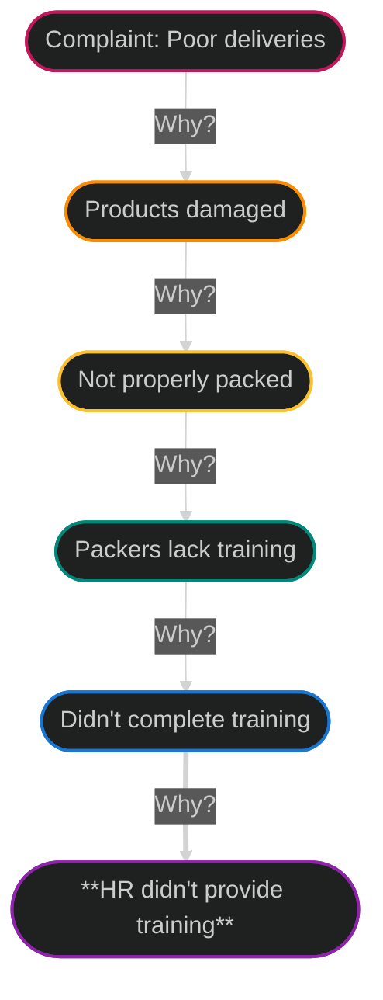

# Introducing data analytics and analytical thinking

## Table of contents

1. [Introduction](#introduction)
2. [Data analytics knowledge and skills](#data-analytics-knowledge-and-skills)
3. [Data analysis process](#data-analysis-process)
4. [Analytical skills](#analytical-skills)
5. [Analytical thinking](#analytical-thinking)
6. [Explore core analytical skills](#explore-core-analytical-skills)
7. [Data-driven decision-making](#data-driven-decision-making)
8. [Module 1 Glossary](#module-1-glossary)

---

## Introduction

> “Data! Data! Data!" he cried impatiently. "I can't make bricks without clay.”  
> *- Arthur Conan Doyle, The Adventure of the Copper Beeches - a Sherlock Holmes Short Story*

The foundation on which data analysis is built is data. Data analysts need data to draw conclusions, make predictions, and inform decisions.

---

## Data analytics knowledge and skills

### Knowledge

Data analysts must have a comprehensive understanding of the data analytics process, which is evidence by:

- a thorough understanding of data-driven decision-making and how it helps organizations guide their business strategy based on facts,
- knowing how to ask questions and make hypotheses about business problems, and how to use them as guidance through the data analysis process,
- the ability to verify data credibility and perform data validation,
- an understanding of data modeling and know how organizations use it as a tool to understand their data, and
- effectively communicate analysis insights to stakeholders by selecting and designing visualization.

### Technical skills

Data analyst must have the technical skills that allow them to complete the data analysis process. They use a variety of tools to analyze data such as spreadsheets, SQL, Tableau, and R to:

- join data from multiple sources to use for data analysis,
- sort data in both spreadsheets and databases,
- clean data by ensuring it contains no duplicate or incorrect entries, and that it is in the correct format,
- create data visualizations using spreadsheets, Tableau, and R,
- write SQL commands to select several columns from a table,
- select and install packages in R to complete specific tasks.

---

## Data Analysis Process

By using **structured thinking**, we can break the data analysis process into smaller, more manageable parts by following this process:

| Step | Task | Meaning |
| --- | --- | --- |
| 1 | **Ask** | Define the problem and confirm stakeholder expectations |
| 2 | **Prepare** | Collect and store data for analysis |
| 3 | **Process** | Clean and transform data to ensure integrity |
| 4 | **Analyze** | Use data analysis tools to draw conclusions |
| 5 | **Share** | Interpret and communicate results to others to make data-driven decisions |
| 6 | **Act** | Put your insights to work in order to solve the original problem |

The data analysis process is designed to build on itself, so the results from each step are the inputs for the next step. This process involves four basic activities:

- recognizing the current problem or situation,
- organizing available information,
- revealing gaps and opportunities, and
- identifying available options

Aside from this data analysis process taught in during the course of the Google Data Analytics Professional Certificate, there are a few other variations of the data analysis process:

1. [EMC data analysis process](https://onlinelibrary.wiley.com/doi/pdf/10.1002/9781119183686)
2. [SAS iterative process](https://www.sas.com/content/dam/SAS/documents/marketing-whitepapers-ebooks/sas-whitepapers/en/manage-analytical-life-cycle-continuous-innovation-106179.pdf)
3. [Project-based data analytics process](https://pingax.com/Data%20Analyst/understanding-data-analytics-project-life-cycle/)
4. [Big data analytics process](https://www.informit.com/articles/article.aspx?p=2473128&seqNum=11&ranMID=24808)

---

## Analytical skills

Analytical skills are qualities and characteristics associated with solving problems using facts. Five essential aspects to analytical skills are:

| Aspect | Meaning |
| --- | --- |
| **Curiosity** | Seek out new challenges and experiences, which leads to knowledge |
| **Understanding context** | How you group things into categories |
| **Technical mindset** | Breaking processes down into smaller steps and working with them in an orderly, logical way |
| **Data Design** | How you organize information |
| **Data Strategy** | Managing the processes and tools used in data analysis |

---

## Analytical thinking

Analytical thinking involves identifying and defining a problem and then solving it by using data in an organized, step-by-step manner.

| Aspect | Meaning |
| --- | --- |
| **Visualization** | The graphical representation of information |
| **Strategy** | Key to staying focused and on track, determining what needs to be achieved the data and how to get there to improve the quality and usefulness of the data we collect |
| **Problem-orientation** | Used to identify, describe, and solve problems |
| **Correlation** | Recognizing relationships between data sets while understanding that correlation does not imply causation |
| **Big-Picture and Detail-Oriented Thinking** | Balancing the ability to see the overall view and the intricate details to innovate and execute plans |

---

## Explore core analytical skills

### What is the root cause of a problem?

A **root cause** is the reason why a problem occurs. If we can identify and get rid of a root cause, we can prevent that problem from happening again. The process called **the Five Whys** can help us reveal to the root cause and to gain useful insights by simply asking "why" five times. An example of the Five Whys in action:

### Where are the gaps in our process?

**Gap analysis** is a method for examining and evaluating how a process works currently in order to get to an improved future state. Businesses conduct gap analysis to improve a product or become more efficient, amongst others. The general approach to gap analysis is:

- defining the current state,
- defining where where you want to be or desired state,
- analyzing the gap between the current and desired state to understand the difference, and
- develop a plan to bridge the gap and determine which steps to take.

### What did we not consider this before?

This is a great way to think about what information or procedure might be missing from a process, so you can identify ways to make better decisions and strategies moving forward.

---

## Data-driven decision-making

Data-driven decision-making involves utilizing facts and evidence to guide business strategies and decisions. Data analysts are crucial to extract these valuable insights from data and doing data quality assurance. Some benefits of data-driven decision-making:

- informed decisions based on data leads to greater confidence
- it promotes proactivity by identifying and capitalizing on opportunities
- it streamline efforts, saving time and resources in achieving goals

---

## Module 1 Glossary

| Term | Definition |
| --- | --- |
| **Analytical skills** | Qualities and characteristics associated with using facts to solve problems |
| **Analytical thinking** | The process of identifying and defining a problem, then solving it by using data in an organized, step-by-step manner |
| **Context** | The condition in which something exists or happens |
| **Data** | A collection of facts |
| **Data analysis** | The collection, transformation, and organization of data in order to draw conclusions, make predictions, and drive informed decision-making |
| **Data analyst** | Someone who collects, transforms, and organizes data in order to draw conclusions, make predictions, and drive informed decision-making |
| **Data analytics** | The science of data |
| **Data design** | How information is organized |
| **Data-driven decision-making** | Using facts to guide business strategy |
| **Data ecosystem** | The various elements that interact with one another in order to produce, manage, store, organize, analyze, and share data |
| **Data science** | A field of study that uses raw data to create new ways of modeling and understanding the unknown |
| **Data strategy** | The management of the people, processes, and tools used in data analysis |
| **Data visualization** | The graphical representation of data |
| **Dataset** | A collection of data that can be manipulated or analyzed as one unit |
| **Gap analysis** | A method for examining and evaluating the current state of a process in order to identify opportunities for improvement in the future |
| **Root cause** | The reason why a problem occurs |
| **Technical mindset** | The ability to break things down into smaller steps or pieces and work with them in an orderly and logical way |

---
