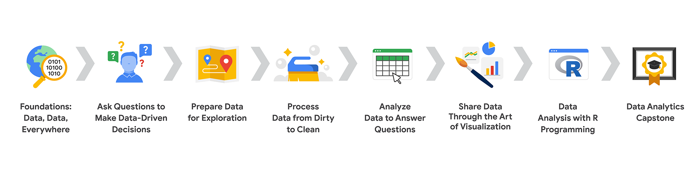

# Google Data Analytics Professional Certificate

Google Career Certificate for Data Analytics was designed and built by subject-matter experts and senior practitioners at Google with input from top employers and industry leaders, like Tableau, Accenture, and Deloitte. The curriculum is hosted by Coursera and teaches job-ready skills that are in demand, such as how to analyze and process data to gain key business insights.

This repository contains my notes and exercises for the 8 courses that make up this professional certificate:

1. [Foundations: Data, Data, Everywhere](/1-Foundations-Data-Data-Everywhere/README.md)
2. [Ask Questions to Make Data-Driven Decisions](/2-Ask-Questions-to-Make-Data-Driven-Decisions/README.md)
3. [Prepare Data For Exploration](/3-Prepare-Data-for-Exploration/README.md)
4. [Process Data from Dirty to Clean](/4-Process-Data-from-Dirty-to-Clean/README.md)
5. [Analyze Data to Answer Questions](/5-Analyze-Data-to-Answer-Questions/README.md)
6. [Share Data Through the Art of Visualization](/6-Share-Data-Through-the-Art-of-Visualization/README.md)
7. [Data Analysis with R Programming](/7-Data-Analysis-with-R-Programming/README.md)
8. [Data Analytics Capstone Project: Complete a Case Study](/8-Google-Data-Analytics-Capstone/README.md)

## Certificate Roadmap

